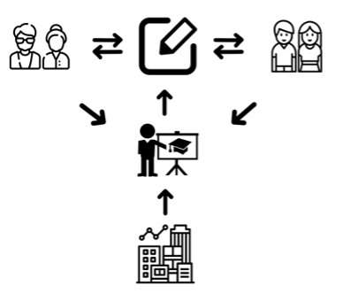
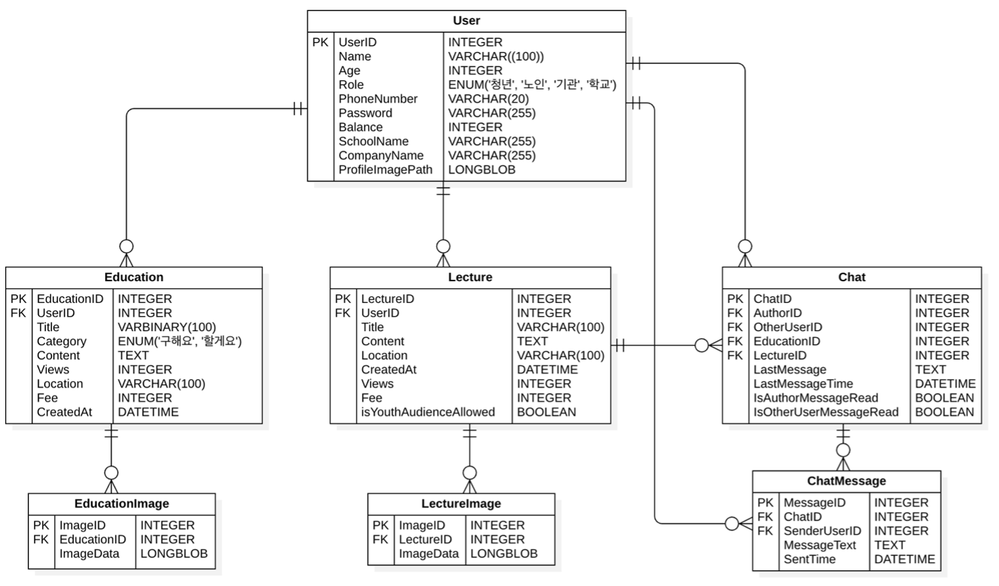
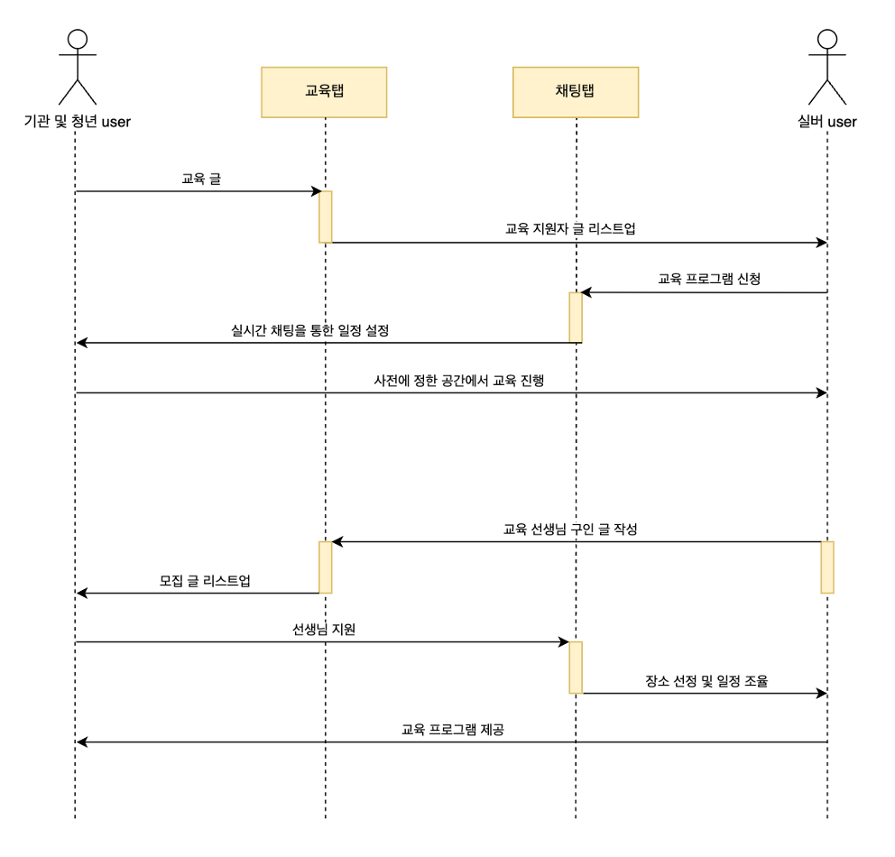
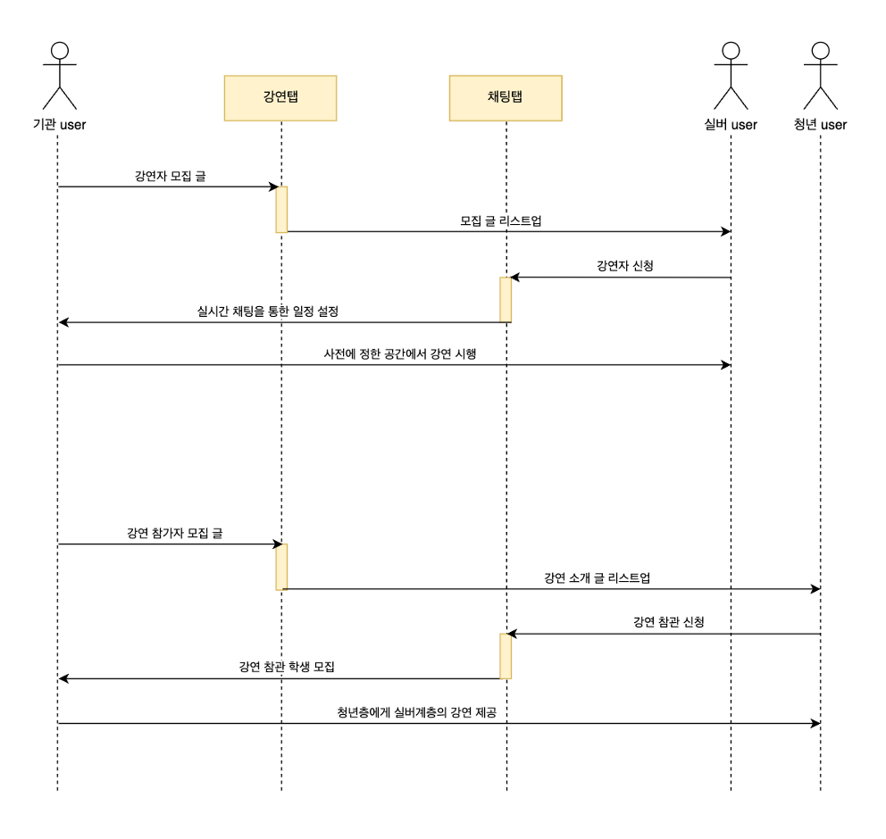

##  제 1회 컴퓨터 정보공학과 해커톤 경진대회 결과 보고서

### 프로젝트명: 디지털 손주

### 프로젝트 요약문
- 이 프로젝트는 고령화 시대에 실버 계층을 위한 사회적 커뮤니티 지원 서비스의 부족을 해결하고자 합니다. 이를 위해 실버 계층이 다양한 교육 프로그램에 참여하거나 청년 계층에게 직접 질문하여 어려움을 해소할 수 있는 어플리케이션을 개발하는 것을 목표로 하고 있습니다. 이 어플리케이션은 실버 계층에게 디지털 교육뿐만 아니라, 일상생활에 필요한 다양한 정보와 도움을 제공하여 디지털 기기를 효과적으로 활용하고 일상에서 겪는 사소한 문제들을 해결할 수 있도록 돕습니다.  
또한, 실버 계층이 청년 세대에게 직업적 경험과 삶의 이야기를 공유할 수 있는 강연 기회를 마련하여, 그들의 지식과 경험을 나누며 새로운 일자리를 창출할 수 있도록 지원합니다. 이 프로젝트는 실버 계층이 사회에 지속적으로 기여하고 경제적 자립을 이루는 동시에, 청년 세대와의 상호작용을 통해 세대 간의 이해와 협력을 촉진하는 것을 목표로 합니다.

  

### 1. 프로젝트 목적
프로젝트의 목적은 고령화 시대에 따른 사회적 문제를 해결하기 위해 실버계층이 은퇴를 하고 나서도 사회적 활동을 지속하여 경제적으로 자립할 수 있는 기회를 제공하고, 그들이 축척한 지식과 경험을 통해 사회에 기여할 수 있는 플랫폼을 마련하는 것입니다.

- **경제적 자립 및 경험 전수를 통한 사회적 기여**
이 프로젝트는 고령화 시대에 실버계층이 은퇴 후에도 경제적으로 자립하고, 그들의 지식과 경험을 통해 사회에 지속적으로 기여할 수 있는 기회를 제공하는 것을 목표로 합니다. <그림 1>에서 볼 수 있듯이, 은퇴 후 경제활동을 지속하는 실버계층의 비율은 점차 감소하고 있으며, 특히 퇴직 후 미취업 상태에 있는 비율이 증가하고 있습니다. 이러한 통계는 실버계층이 은퇴 후에도 경제적 자립을 유지하는 데 어려움을 겪고 있음을 보여줍니다. 이를 해결하기 위해, 실버계층이 자신의 소중한 경험과 직업적 전문 지식을 다음 세대에 전수할 수 있는 강연 기회를 마련하여, 새로운 일자리를 창출할 수 있도록 지원합니다. 또한, 학교나 주민센터에서 특강과 소모임을 통해 실버계층의 경험과 노하우를 사회에 공유할 수 있는 장을 마련함으로써, 그들의 경제적 안정성과 사회적 기여를 동시에 촉진합니다.

  
     <그림 1 은퇴 후 경제활동 상태 조사 결과>

- **디지털 활용 능력 향상 및 생활 편의성 증진**
실버계층이 기본적인 디지털 기기 사용은 가능하지만, 일상에서 발생하는 복잡한 문제나 기술적 어려움에 직면할 수 있습니다. <그림 1>에서 보듯이, 연령별 인터넷뱅킹 이용률을 살펴보면 50대 이후부터 급격히 감소하며, 70세 이상에서는 6.4%에 불과합니다. 이는 실버계층이 디지털 기기를 활용하는 데 있어서 어려움을 겪고 있음을 보여줍니다. 또한, <그림 2>에서는 경기도 65세 이상 실버계층의 '정보화기기' 활용 현황을 나타내고 있습니다. 이 중 71.9%가 전자·정보화기기 활용에 불편함을 느끼고 있으며, 특히 키오스크 활용에 어려움을 겪고 있습니다. 정보화기기 사용 역량 부분에서도 문서 작성이나 정보 검색에는 어려움을 느끼는 비율이 높습니다. 이러한 문제를 해결하기 위해 청년 계층과의 소통을 통해 디지털 활용 능력뿐만 아니라, 노인분들이 잘 모를 수 있는 다양한 정보와 기술적 지식을 함께 제공하여, 생활의 편의성을 높이는 것을 목표로 하고 있습니다.

  
     <그림 1 연령별 인터넷 뱅킹 이용률> 현황>

  
    <그림 2 65세 이상 정보화기기 활용 
/p>

### 2. 프로젝트 목표 및 기대 효과
#### 2-1 프로젝트 목표
- **사회적 선순환 구조 구축**
실버계층과 청년층이 서로 상호작용하며 도움을 주고받는 구조를 형성하여, 사회 전체의 활성화를 촉진하는 것을 목표로 합니다. 이를 통해 세대 간의 협력과 이해를 증진시키고, 사회적 통합을 강화합니다.
 
- **실버계층의 일자리 창출**
연령이 높아질수록 일자리가 사라지는 현상을 방지하기 위해, 실버계층이 가진 고유한 능력과 경험을 활용한 일자리를 제공합니다. 역사적 사실 강연과 디지털 교육을 통해 실버계층이 경제적으로 자립할 수 있는 기회를 마련하고, 그들의 경제적 안정성을 높이는 것을 목표로 합니다.
 
- **디지털 격차 해소 및 생활 지원**
실버계층이 디지털 기기를 보다 효과적으로 활용할 수 있도록 지원하여, 삶의 질을 향상시키는 것을 목표로 합니다. 또한, 디지털 기기 사용 중 발생하는 사소한 문제뿐만 아니라, 일상생활에서 필요한 다양한 정보와 도움을 제공하여, 실버계층이 일상생활을 영위할 수 있도록 지원합니다.
 
#### 2-2 프로젝트 기대효과
- **사회적 통합과 디지털 접근성 향상**
실버 계층과 청년층 간의 교류가 활성화되어 세대 간의 이해와 협력이 증진됩니다. 또한 실버 계층의 디지털 기기 활용 능력이 향상되어, 정보 접근성과 생활 편의성이 개선됩니다.
 
- **지속 가능한 일자리 창출**
실버계층이 강연을 통해 지속 가능한 일자리를 확보하며, 역사적 지식과 삶의 지혜를 다음 세대에 전수할 수 있습니다. 실버계층은 단순한 강연만이 아니라 더 나아가 농사, 과일 재배 등의 노하우 또한 강연의 일부로 분야를 넓혀 다양한 분야의 실버계층 이용자들이 경제적 활동을 영위할 수 있게 될 것입니다.

### 3. 설계 내용

  
     <디지털 손주 ERD> 

  
     <로그인 회원가입 시퀀스 다이어그램> 

  
     <교육 시퀀스 다이어그램> 

  
     <강연 시퀀스 다이어그램> 

#### 사용한 API
**회원가입 시 학교 또는 기업 인증 시 사용**

**커리어넷 학교 정보 API:** https://www.career.go.kr/cnet/front/openapi/openApiSchoolCenter.do

**공공데이터포털 금융위원회_기본기업정보:**: https://www.career.go.kr/cnet/front/openapi/openApiSchoolCenter.do